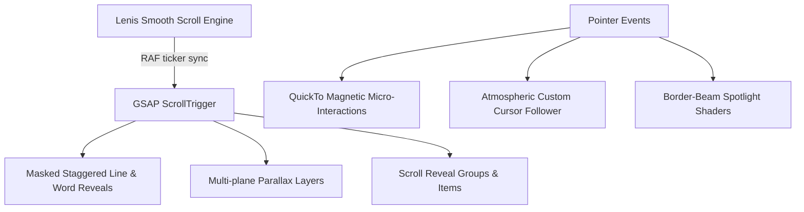

# High-Performance Cinematic Engineering Portfolio: Interaction & Motion Architecture

> **Positioning**: Control Systems Engineering, Mission-Critical SRE & Production Artificial Intelligence  
> **Candidate**: José Luis Sarta Álvarez (Senior Software Expert & Service Reliability Lead | MSc AI Candidate @ UniAndes | Electronic Control Engineer)

---

## 1. Grounded Technical Copy (Anti-AI Jargon)

### Spanish (ES)
- **Titular Principal**: *"Rigor de Sistemas de Control aplicado a Inteligencia Artificial en Producción."*
- **Subtítulo**: *"Senior Software Expert & SRE Lead, MSc en IA e Ingeniero en Control Electrónico. Diseñando sistemas distribuidos de ultra-alta disponibilidad (99.99% SLA), pipelines agénticos de baja latencia y arquitecturas de IA deterministas a escala."*
- **Status Indicator**: `• ARQUITECTURA DE SISTEMAS IA • SRE DE MISIÓN CRÍTICA • FLUJOS AGÉNTICOS`

### English (EN)
- **Primary Headline**: *"Bridging Control Systems Rigor with Frontier AI in Production."*
- **Subheadline**: *"Senior Software Expert & SRE Lead with an MSc in AI and an Electronic Control Engineering foundation. Architecting ultra-reliable, high-throughput distributed systems (99.99% SLA), low-latency agentic pipelines, and deterministic AI architectures at scale."*
- **Status Indicator**: `• AI SYSTEMS ARCHITECTURE • MISSION-CRITICAL SRE • AGENTIC WORKFLOWS`

---

## 2. Cinematic Motion System Blueprint

Chaining **`html-to-interaction-prompts`** with **`cinematic-gsap-lenis-motion-system`**:

### Motion Pipeline Tokens
- **Inertial Easing**: Lenis smooth wheel with `lerp: 0.08`, `wheelMultiplier: 0.9`.
- **Text Masking**: GSAP `fromTo` with `yPercent: 100 -> 0`, `filter: blur(8px) -> blur(0px)` on masked spans with `power4.out`.
- **Magnetic Buttons**: Dual GSAP `quickTo` coordinates with tactile click compression `scale(0.96)`.
- **Camera Depth / Mouse Parallax**: Layered depth coordinates (`data-mouse-depth="0.015"` to `0.04"`).
- **Dynamic Lighting**: Hairline border-beam pseudo-elements (`.spotlight-card::after`) with radial gradient masking.
- **Ambient Engineering Canvas**: Dynamic phase-space state vectors and ambient neural activation mesh.
